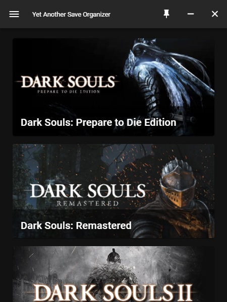
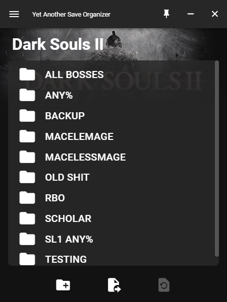
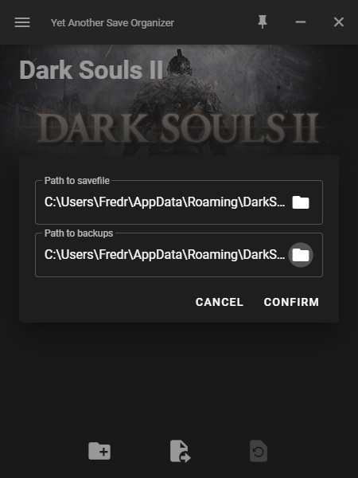

#  Yet Another Save Organizer

## What it do?
Yet Another Save Organizer (<b>YASO</b>) uses Electron combined with Vue to provide the file management capabilities of other save organizer combined with the modern aesthetic of javascript single page applications.

<p align="center">
     &nbsp; &nbsp; 
</p>

## Features of YASO
- <b>Global hotkeys:</b> Assign your own key combinations to load a savefile, switch between backups and toggle always on top, all while inside the game.
- <b>Customize your games:</b> Designed for, but not restricted to the Souls series. Add any game + image you want, or remove the ones that are already there. If the game uses a single savefile, it probably works.
- <b>Scalable UI:</b> Take up as much or as little space as you want. If you play windowed you can even use it as a small overlay when always on top.

## How to add your own games
When you first launch YASO a folder will be created in your documents folder containing configuration files and images. To add your own games you will need to add a new image in the images folder, and add a new entry to games.json. Once done, simply restart YASO and your game should show up. For any game you select for the first time you will be asked for the location of the savefile, as well as where to store your backups. Simply click the folder icon and select the correct file or folder. (UI making this process simpler planned as a future feature)

<p align="center">
    
</p>

## FAQ
If you have some questions or suggestions for improvements, feel free to open a GitHub issue or contact me through discord (Stennis#4562).

## Project setup
If you want to work on the application for yourself, or build directly from source, here are some useful commands to get you started (requires installation of Node.js).

```
npm install
```

### Compiles and runs electron with hot reload
```
npm run electron:serve
```

### Compiles electron app for production
```
npm run electron:build
```
